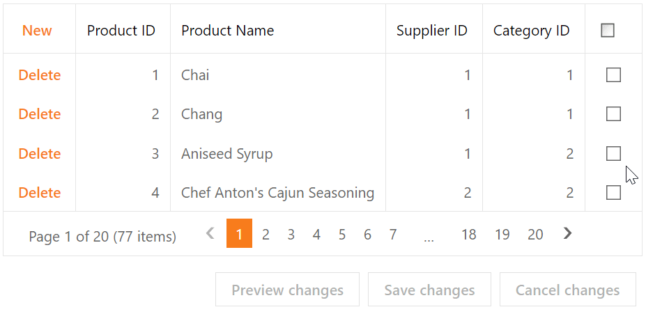

<!-- default badges list -->

[](https://supportcenter.devexpress.com/ticket/details/T282835)
[](https://docs.devexpress.com/GeneralInformation/403183)
<!-- default badges end -->
# Grid View for ASP.NET Web Forms - Implement the Select All check box for a templated column in batch edit mode
<!-- run online -->
**[[Run Online]](https://codecentral.devexpress.com/t282835/)**
<!-- run online end -->

This example demonstrates how to create a header template, add a check box to the template, and implement the Select All functionality in batch edit mode.



## Overview

Follow the steps below to implement the **Select All** functionality in a column's header in batch edit mode:

1. Specify a column's [HeaderTemplate](https://docs.devexpress.com/AspNet/DevExpress.Web.GridViewColumn.HeaderTemplate) property and add a check box editor to the template.

    ```aspx
    <dx:GridViewDataCheckColumn FieldName="Discontinued" VisibleIndex="6">
        <!-- ... -->
        <HeaderTemplate>
            <dx:ASPxCheckBox ID="HeaderCheckBox" ClientIDMode="Static" runat="server"
                ClientInstanceName="HeaderCheckBox" ... >
                <ClientSideEvents CheckedChanged="OnHeaderCheckBoxCheckedChanged" Init="OnInitHeader" />
            </dx:ASPxCheckBox>
        </HeaderTemplate>
        <Settings AllowSort="False" />
    </dx:GridViewDataCheckColumn>
    ```

2. Handle the editor's client-side `CheckedChanged` event. In the handler, call the grid's [SetCellValue](https://docs.devexpress.com/AspNet/js-ASPxClientGridViewBatchEditApi.SetCellValue(visibleIndex-columnFieldNameOrId-value)) method to assign a value to the specified cell based on the check box state.

    ```js
    function OnHeaderCheckBoxCheckedChanged(s, e) {
        var visibleIndices = Grid.batchEditApi.GetRowVisibleIndices();
        var totalRowsCountOnPage = visibleIndices.length;
        for (var i = 0; i < totalRowsCountOnPage ; i++) {
            Grid.batchEditApi.SetCellValue(visibleIndices[i], "Discontinued", s.GetChecked())
        }
    }
    ```

3. Handle the grid's client-side [BatchEditEndEditing](https://docs.devexpress.com/AspNet/js-ASPxClientGridView.BatchEditEndEditing), [BatchEditRowDeleting](https://docs.devexpress.com/AspNet/js-ASPxClientGridView.BatchEditRowDeleting), and [BatchEditRowInserting](https://docs.devexpress.com/AspNet/js-ASPxClientGridView.BatchEditRowInserting) events. In the handlers, call the `CheckSelectedCellsOnPage` function. In this function, compare the number of selected rows and the total number of visible rows. Based on a result, specify the state of the checkbox editor.

    ```js
    function CheckSelectedCellsOnPage(checkType) {
        var currentlySelectedRowsCount = 0;
        var visibleIndices = Grid.batchEditApi.GetRowVisibleIndices();
        var totalRowsCountOnPage = visibleIndices.length;
        for (var i = 0; i < totalRowsCountOnPage ; i++) {
            if (Grid.batchEditApi.GetCellValue(visibleIndices[i], "Discontinued"))
                currentlySelectedRowsCount++;
        }
        if (checkType == "insertCheck")
            totalRowsCountOnPage++;
        else if (checkType == "deleteCheck") {
            totalRowsCountOnPage--;
            if (DeletedValue)
                currentlySelectedRowsCount--;
        }
        if (currentlySelectedRowsCount <= 0)
            HeaderCheckBox.SetCheckState("Unchecked");
        else if (currentlySelectedRowsCount >= totalRowsCountOnPage)
            HeaderCheckBox.SetCheckState("Checked");
        else
            HeaderCheckBox.SetCheckState("Indeterminate");
    }
    ```

## Files to Review

* [Default.aspx](./CS/Default.aspx) (VB: [Default.aspx](./VB/Default.aspx))

## Documentation

* [Grid in Batch Edit Mode](https://docs.devexpress.com/AspNet/16443/components/grid-view/concepts/edit-data/batch-edit-mode)
* [Grid View Templates](https://docs.devexpress.com/AspNet/3718/components/grid-view/concepts/templates)

## More Examples

* [Grid View for ASP.NET MVC - Implement the Select All check box for a templated column in batch edit mode](https://github.com/DevExpress-Examples/gridview-how-to-implement-the-select-all-feature-for-a-checkbox-column-in-batch-edit-mode-t401286)
